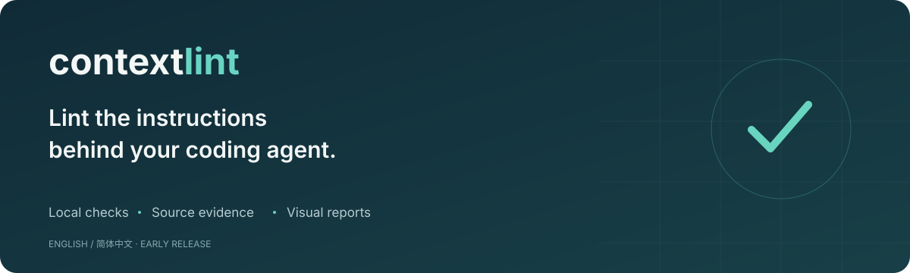
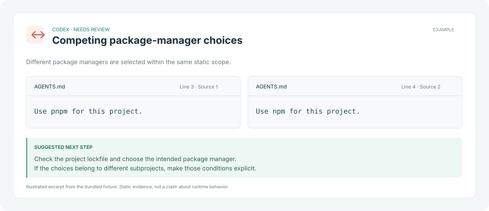

<p align="center"></p>

<p align="center">
  <a href="https://github.com/BillWGong/contextlint/actions/workflows/ci.yml"></a>
  <a href="LICENSE"></a>
  
  
</p>

<p align="center"><strong>English</strong> · <a href="README.zh-CN.md">简体中文</a></p>

# ContextLint

**Lint the instructions behind your coding agent.**

A local CLI that finds repeated rules, explicit potential conflicts, and broken references in `AGENTS.md`, `CLAUDE.md`, and other coding-agent instruction files. Open an offline report with the original text, file locations, and suggested next steps.

No API key. No model calls. No file uploads during scanning.

<p align="center"></p>

## Try it

Requires **Node.js 22+** and **pnpm**. This is an early release distributed from source; it is not published to npm.

```bash
git clone https://github.com/BillWGong/contextlint.git
cd contextlint
pnpm install --frozen-lockfile
pnpm build

# Start with the included example
node dist/cli.js examples/demo --agent codex --html report.html
```

Open `report.html` in your browser. Switch between **English** and **简体中文** in the top-right corner, filter findings, or search the original instructions. The file works offline; JavaScript enables filters and language switching.

Then point the CLI at your own repository:

```bash
node dist/cli.js /path/to/your/repo --agent codex --html report.html
```

For a terminal report, omit `--html`. Use `--lang en` or `--lang zh` to choose the interface language. The CLI defaults to your locale, then English. Instruction text is always preserved in its original language.

## What you get

| Check | Evidence | Suggested next step |
| --- | --- | --- |
| Package-manager conflicts | Explicit competing `Use pnpm` / `Use npm` choices | Check the lockfile and clarify the intended tool |
| Opposite directives | Matching actions with `Always` / `Never`, or supported Chinese equivalents | Keep the intended rule or add missing conditions |
| Repeated rules | Matching text after limited normalization | Review whether both copies are needed |
| Broken references | Relative Markdown links with missing local targets | Update, restore, or remove the reference |

Every finding includes its original file and line range. The HTML report explains what was matched and offers guidance. It does not edit your files.

**Scope matters.** Files for different agents are separated. Different heading contexts, parent/child directory rules, and unresolved activation conditions are handled conservatively. A Cursor rule and a Codex rule choosing different tools are not automatically a conflict.

## CLI

```bash
# Human-readable terminal output
node dist/cli.js . --agent codex --lang en

# Chinese interface and a Chinese-language sample
node dist/cli.js examples/zh-demo --lang zh --html report-zh.html

# Stable machine-readable output
node dist/cli.js . --json > findings.json

# CI: exit 1 if warning findings exist
node dist/cli.js . --agent codex --strict --json > findings.json

# Exclude a literal relative file or directory; repeat as needed
node dist/cli.js . --exclude fixtures --exclude legacy
```

| Option | Behavior |
| --- | --- |
| `--agent claude\|codex\|cursor\|copilot` | Select instruction sources for one agent |
| `--html <file.html>` | Write a self-contained visual report; parent directory must exist |
| `--lang en\|zh` | Choose CLI and initial report language |
| `--json` | Emit language-independent JSON with `schemaVersion: "1.0"` |
| `--strict` | Return exit code 1 when warning findings exist |
| `--exclude <path>` | Exclude a literal relative path; no globs |

HTML and JSON are separate output modes. Exit codes: **0** completed, **1** strict threshold reached, **2** usage or execution error. JSON report data goes to stdout; errors go to stderr. JSON field names and diagnostics remain stable English strings regardless of interface language.

## Supported files

| Source | Agent classification | Comparison policy |
| --- | --- | --- |
| `AGENTS.md` | Codex / Copilot | Directory scope; nested directories stay separate |
| `CLAUDE.md` | Claude | Directory scope |
| `.claude/rules/**/*.md` | Claude | File-local comparisons; activation unresolved |
| `.cursor/rules/**/*.mdc` / `.md` | Cursor | Cross-file only with simple `alwaysApply: true` and no nonempty `globs` |
| `.github/copilot-instructions.md` | Copilot | Project directory scope |
| `.github/instructions/**/*.instructions.md` | Copilot | File-local comparisons; activation unresolved |

`--agent` selects a static source set. It does not simulate an agent's instruction-loading system. Global instructions, imports, skills, `AGENTS.override.md`, and custom fallback filenames are not scanned in this release.

## Deliberate limits

- This is a **static linter**, not a runtime debugger. It cannot prove which instructions an agent loaded or followed.
- Conflict detection uses a small set of explicit English and Chinese patterns. It does not understand arbitrary natural-language contradictions.
- Code fences, quoted examples, comments, and recognized conditions are excluded from conflict checks. Markdown and frontmatter parsing are intentionally limited.
- Different heading paths and nested directories are not compared as conflicts. That avoids some misleading findings and can miss real problems.
- Local Markdown links are resolved from the instruction file directory, within the scan root. URLs, absolute paths, images, templates, and bare backtick paths are skipped.
- Token counts are heuristic estimates, not session usage or cost savings. A clean report is not a correctness guarantee.
- The scanner skips common dependency/build directories and symlinks. It does not apply `.gitignore`; use `--exclude` for additional paths. Files over 1 MiB are skipped.

See [detection rules](docs/rules.md), [JSON Schema](docs/report.schema.json), and [validation notes](docs/validation.md) for details.

## Development

```bash
pnpm install --frozen-lockfile
pnpm test
pnpm build
pnpm pack
```

TypeScript + Node.js, with **zero production dependencies**. The public API exports `lint(root, options)` from `dist/index.js`.

```js
import { lint } from './dist/index.js';
const report = await lint('/path/to/repo', { agent: 'codex' });
console.log(report.findings);
```

Contributions are welcome, especially real examples that expose a false positive or a missed finding. See [CONTRIBUTING.md](CONTRIBUTING.md). Please remove private instructions and paths before sharing a report.

## Next

- More annotated examples from real repositories.
- Better condition and activation parsing.
- Codex override/fallback discovery and source queries.

[Related projects](docs/market-check.md) explore this space too. ContextLint focuses on a conservative, evidence-first review workflow and bilingual visual reports.

## License

[MIT](LICENSE).
